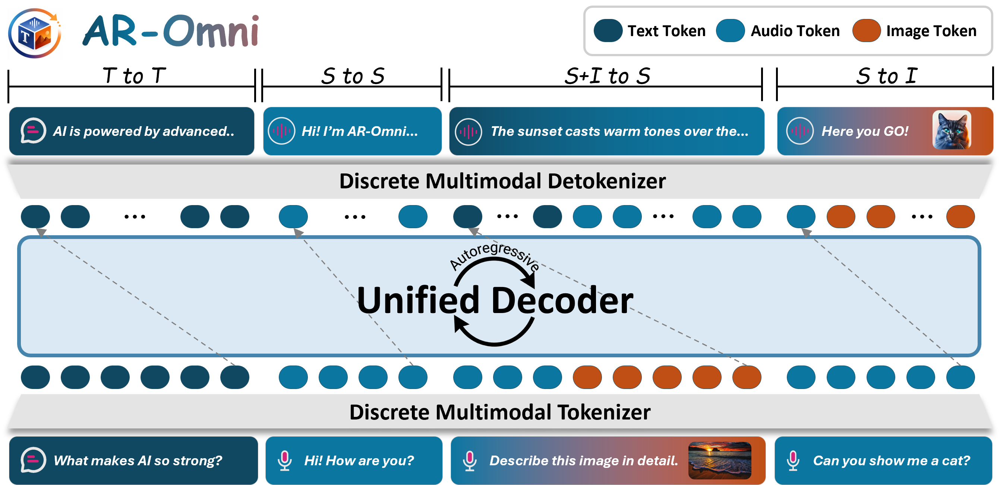

<a name="readme-top"></a>

<div align="center">
  <h1 align="center">AR-Omni: A Unified Autoregressive Model for Any-to-Any Generation</h1>
</div>

<div align="center">
  <!-- Paper Link -->
  <a href="TBD">
    
  </a>
  <!-- HuggingFace Papers -->
  <a href="TBD">
    
  </a>
  <!-- Project Page -->
  <a href="TBD">
    
  </a><br>
  <!-- HuggingFace Models -->
  <a href="https://huggingface.co/charlesdj/AR-Omni-Pretrain-v0.1">
    
  </a>
  <a href="https://huggingface.co/charlesdj/AR-Omni-Chat-v0.1">
    
  </a>
  <!-- HuggingFace Dataset -->
  <a href="https://huggingface.co/datasets/charlesdj/AR-Omni-Instruct-v0.1">
    
  </a>

  <!-- Optional: overview figure -->
  
</div>

---

Welcome to **AR-Omni**! 👋 AR-Omni is a *single-decoder*, *single-token-stream* autoregressive any-to-any model that generates **text**, **images**, and **speech** without expert decoders. It uses task-aware loss reweighting, token-level perceptual alignment for image tokens, and a finite-state decoding machine to balance modality learning, improve visual fidelity, and trade off stability vs. creativity during inference.

---

## 🪐 Key Features

> [!IMPORTANT]
> Pure autoregressive “Omni” without expert decoders. AR-Omni uses a single Transformer decoder to support autoregressive text and image generation, as well as real-time speech synthesis (as measured by the TTS task).

🧭 **Unified any-to-any AR paradigm**  
A single token stream with next-token prediction and one decoder, natively handling text, images, and speech—while preserving the purity of autoregressive modeling.

⚖️ **Modality imbalance mitigation**  
Task-aware loss reweighting to prevent training from being dominated by a subset of modalities or tasks.

🎛️ **Stability–creativity trade-offs**  
A finite-state decoding machine that selects different decoding strategies for different sub-tasks during inference.

🗣️ **Real-time speech synthesis**  
Efficient real-time speech synthesis (as measured by the TTS task).

---

## 🔥 News
- **2026.01** Initial release of AR-Omni v0.1.

---

## Roadmap

- [x] AR-Omni-Pretrain checkpoint 
- [x] AR-Omni-Chat checkpoint 
- [x] Instruction-tuning dataset  
- [x] Training code and recipes
- [ ] Paper link  
- [ ] Streaming inference
- [ ] Public demo / gradio / space

---

## 📑 Table of Contents <span id="table-of-contents"></span>

* [🚀 Quick Start](#quick-start)
  * [1. Installation](#installation)
  * [2. Inference](#inference)
    * [Checkpoints](#inference-ckpt)
    * [AR-Omni-Pretrain](#inference-pretrain)
    * [AR-Omni-Chat](#inference-chat)
  * [3. Training](#training)
    * [Data](#training-data)
    * [Pretrain](#training-pretrain)
    * [Instruction Tuning](#training-sft)
* [✨ How It Works](#how-it-works)
* [🗂️ Project Structure](#project-structure)
* [🌱 Acknowledgements](#acknowledgements)
* [📚 Citation](#citation)
---

## 🚀 Quick Start <span id="quick-start"></span>

### 1. Installation <span id="installation"></span>
**General requirements.** Except for basic libs, we vendor two editable libraries in this repo: accelerate and transformers.

```bash
python -m venv .venv
source .venv/bin/activate

pip install -U pip wheel setuptools

pip install -r requirements.txt

# Install the provided libs
pip install -e ./transformers
pip install -e ./accelerate
```

**CosyVoice.** Please configure the CosyVoice environment (PyTorch/CUDA/audio dependencies, model assets, etc.) by following the official guide:
- https://github.com/FunAudioLLM/CosyVoice
```bash
git clone https://github.com/FunAudioLLM/CosyVoice.git
```

---

### 2. Inference <span id="inference"></span>
#### Checkpoints <span id="inference-ckpt"></span>

- **AR-Omni-Pretrain-v0.1**: https://huggingface.co/charlesdj/AR-Omni-Pretrain-v0.1  
- **AR-Omni-Chat-v0.1**: https://huggingface.co/charlesdj/AR-Omni-Chat-v0.1

---

#### AR-Omni-Pretrain <span id="inference-pretrain"></span>

Below are four commands for the four core tasks.  

##### (1) TTS
```bash
python inference/inference_pretrain.py \
  --ckpt_path /path/to/AR-Omni-Pretrain-v0.1 \
  --tokenizer_path /path/to/AR-Omni-Pretrain-v0.1 \
  --out_dir ./outputs/tts \
  --device 0 \
  tts \
  --text "Good afternoon! How are you today?" \
  --instruction "Convert this text into speech." \
  --wavtokenizer_root /path/to/WavTokenizer \
  --wavtokenizer_config /path/to/wavtokenizer.yaml \
  --wavtokenizer_ckpt /path/to/wavtokenizer.ckpt \
  --max_gen_len 256 \
  --out_name tts.wav
```

##### (2) ASR
```bash
python inference/inference_pretrain.py \
  --ckpt_path /path/to/AR-Omni-Pretrain-v0.1 \
  --tokenizer_path /path/to/AR-Omni-Pretrain-v0.1 \
  --out_dir ./outputs/asr \
  --device 0 \
  asr \
  --speech_path inference/ref.wav \
  --wavtokenizer_root /path/to/WavTokenizer \
  --wavtokenizer_config /path/to/wavtokenizer.yaml \
  --wavtokenizer_ckpt /path/to/wavtokenizer.ckpt \
  --instruction "Can you please convert this speech into written text?" \
  --max_seq_len 1024
```

##### (3) Image Captioning
```bash
python inference/inference_pretrain.py \
  --ckpt_path /path/to/AR-Omni-Pretrain-v0.1 \
  --tokenizer_path /path/to/AR-Omni-Pretrain-v0.1 \
  --out_dir ./outputs/caption \
  --device 0 \
  caption \
  --image_path inference/demo_test.jpg \
  --instruction "Describe this image in detail." \
  --max_gen_len 256
```

##### (4) Text-to-Image (T2I)

```bash
python inference/inference_pretrain.py \
  --ckpt_path /path/to/AR-Omni-Pretrain-v0.1 \
  --tokenizer_path /path/to/AR-Omni-Pretrain-v0.1 \
  --out_dir ./outputs/t2i \
  --device 0 \
  t2i \
  --text "a bunch of ripe strawberries on a plate" \
  --temp 1.0 \
  --guidance_scale_image 1.32 \
  --out_name t2i_test.png
```

---

#### AR-Omni-Chat (Interleaved Any-to-Any Conversation) <span id="inference-chat"></span>
> [!NOTE]
> In AR-Omni-v0.1, no real speech recordings were included in training. We recommend testing with clean, clear speech. We provide `speech2tokens.py`, a CosyVoice-based TTS input script for quick use and as a development reference. We will open-source the next version as soon as possible. The next release is optimized for real-world speech scenarios.

`inference_chat.py` runs dialog(s) described in a JSON/JSONL file and saves decoded text / images / speech generation.
It supports:
- **(Recommended for now) Text → (CosyVoice2 TTS) → Input** 
- **WAV → Input**
- Optional **image(s)** per turn via `image_paths`

---

##### (1) Run command

> Requires **CosyVoice2**.  
> If CosyVoice is not installed as a package, set `PYTHONPATH` to include its repo.

```bash
PYTHONPATH=/path/to/CosyVoice/third_party/Matcha-TTS:/path/to/CosyVoice${PYTHONPATH:+:$PYTHONPATH} \
python3 inference/inference_chat.py \
  --input ./infer_test.json \
  --output_dir ./test_results \
  --model_root /path/to/converted_model_root \
  --hf_tokenizer /path/to/converted_model_root \
  --cosyvoice_model_dir /path/to/CosyVoice2-0.5B \
  --wavtokenizer_cfg_path /path/to/wavtokenizer.yaml \
  --wavtokenizer_ckpt_path /path/to/wavtokenizer.ckpt \
  --save_speech --save_images
```

Common optional flags:
- `--greedy` : greedy decode for text
- `--txt_temp`, `--txt_top_p` : sampling settings for text
- `--img_temp` : sampling temp for image tokens
- `--bandwidth_id` : wavtokenizer bandwidth id

---

##### (2) Input schema

You can pass:
- a single dialog: `{"dialog_id": "...", "turns": [ ... ]}`
- a list of dialogs: `[{"dialog_id": "...", "turns": [...]}, ...]`
- a list of turns: `[{turn}, {turn}, ...]`

Each **turn** must provide **either**:
- `text`: user text will be converted to speech and then tokenized
- `wav_path`: directly tokenize a WAV file

Optional fields per turn:
- `image_paths`: list of image paths for this turn
- `user_append_text`: appended instruction after vocal tokens
- `speaker_wav`: reference speaker WAV for CosyVoice2
- `prompt_text`: optional prompt text for speaker/style
- `silence_head_sec`, `silence_tail_sec`: silence padding seconds
- `silence_head_tokens`, `silence_tail_tokens`: explicit silence token padding
- `reset`: reset conversation history before this turn

---

##### (3) Example input

Create `infer_test.json`:

```json
{
  "dialog_id": "demo_0001",
  "turns": [
    {
      "text": "Describe the image in detail.",
      "image_paths": ["inference/demo_test.jpg"],
      "user_append_text": "Please acknowledge the user's vocal input, create a textual response.",
      "reset": true
    }
  ]
}
```
```json
{
  "dialog_id": "demo_0002",
  "turns": [
    {
      "text": "Can you show me the sunset?",
      "user_append_text": "Please transcribe the user's vocal input, create a picture of it.",
      "reset": true
    }
  ]
}
```

---

##### (4) Outputs

Artifacts are saved under:

- `output_dir/<dialog_id>/turn_<index>_<uid>/decoded_text.txt`
- `output_dir/<dialog_id>/turn_<index>_<uid>/meta.json`
- optional images/speech if enabled:
  - `.../*_seg*_img*_.png`
  - `.../*_seg*_speech_*.wav`
- a global log:
  - `output_dir/batch_log.json`

---

### 3. Training <span id="training"></span>

We provide two training stages: pre-training and instruction tuning.

#### 3.1 Data <span id="training-data"></span>

AR-Omni is trained on **tokenized multimodal sequences**. In both stages, the multimodal content has already been converted into **discrete tokens** and can be fed directly to the autoregressive model.

- **Pretrain data**: built from public corpora at a large scale. Due to the dataset size and distributed sources, we do not host a packaged pretrain dataset in this repo. Please refer to the paper for the data recipe and obtain the open-source corpora accordingly.
- **Instruction tuning data**: our open-source release is provided as tokenized multimodal instruction data:
  - https://huggingface.co/datasets/charlesdj/AR-Omni-Instruct-v0.1

---

#### 3.2 Pretraining <span id="training-pretrain"></span>

```bash
cd training/pretrain

deepspeed --num_gpus 8 pretrain.py \
  --model_path /path/to/base_model \
  --output_path /path/to/output_pretrain_ckpt \
  --dataset_dir /path/to/pretrain_jsonl_shards \
  --deepspeed_config ds_config.json \
  --learning_rate 1e-5 \
  --gradient_accumulation_steps 1 \
  --response_weighted_tasks "image_caption,speech_to_text" \
  --response_seg_weight 2.0 \
  --perception_weight 1.0
```

Common options:
- `--resume_from_checkpoint /path/to/ckpt`
- `--skip_shards N --skip_samples N`

---

#### 3.3 Instruction Tuning <span id="training-sft"></span>

```bash
cd training/instruction-tuning

deepspeed --num_gpus 8 sft.py \
  --data_path /path/to/AR-Omni-Instruct-v0.1.parquet \
  --model_path /path/to/pretrained_or_base_model \
  --output_path /path/to/output_sft_ckpt \
  --deepspeed_config /path/to/ds_config.json \
  --learning_rate 1e-5 \
  --gradient_accumulation_steps 1 \
  --sl_project YOUR_PROJECT \
  --sl_experiment YOUR_EXPERIMENT \
  --max_length 2048 \
  --segment_loss_weight 1.0 \
  --global_weight 1.0
```

Common options:
- `--resume_from_checkpoint /path/to/ckpt`
- `--sl_key YOUR_SWANLAB_KEY` (optional)


---

## ✨ How It Works <span id="how-it-works"></span>

AR-Omni is a unified any-to-any model in the autoregressive paradigm **without** expert decoders.

- **One** decoder, **one** token stream, **one** objective
- Multimodal generation is completely formulated as standard next-token prediction over an interleaved sequence.

Three practical issues in unified AR modeling and our fixes:

1) **Modality imbalance** → task-aware loss reweighting.
   Unified AR training can be dominated by modalities with longer token budgets. We use a Weighted NTP objective that upweights task-relevant response tokens, keeping optimization aligned with the intended outputs and preventing skewed learning in unified training.

2) **Visual fidelity** → lightweight token-level perceptual alignment loss for image tokens.  
   Cross-entropy provides exact-match supervision but lacks geometric awareness in discrete visual codes. We add a small perceptual alignment loss that aligns hidden states to a frozen image embedding space, encouraging visually coherent structures even when token-level matches are imperfect.

3) **Stability–creativity trade-offs** → finite-state decoding with task-aware strategy switching.  
   Different tasks prefer different decoding behaviors. We use a finite-state decoding machine that switches strategies within one generation, using greedy decoding for deterministic subtasks and sampling for open-ended generation, avoiding a one-size-fits-all decoding rule.


---

## 🗂️ Project Structure <span id="project-structure"></span>

```plaintext
.
├── README.md
├── LICENSE
├── requirements.txt
│
├── assets/
│   ├── LOGO.png
│   └── overview.png
│
├── training/
│   ├── pretrain/
│   │   ├── pretrain.py            # entry
│   │   ├── pretrain_trainer.py
│   │   ├── perception.py
│   │   └── ds_config.json
│   └── instruction-tuning/
│       ├── sft.py                 # entry
│       ├── trainer.py
│       └── perception.py
│
├── inference/
│   ├── inference_pretrain.py      # entry
│   ├── inference_chat.py          # entry
│   ├── speech2tokens.py
│   ├── infer_test.json
│   ├── demo_test.jpg
│   └── ref.wav
│
├── accelerate/
└── transformers/
```

---

## 🌱 Acknowledgements <span id="acknowledgements"></span>

We thank the open-source projects and research community that made this work possible.

<!-- Acknowledgement tags (badges) --> 
[](https://github.com/facebookresearch/chameleon) [](https://github.com/GAIR-NLP/anole) [](https://github.com/GAIR-NLP/thinking-with-generated-images) [](https://iclr-blogposts.github.io/2025/blog/fine-tuning-token-based-large-multimodal-models/) [](https://github.com/huggingface/transformers) [](https://github.com/OpenMOSS/AnyGPT) [](https://huggingface.co/datasets/OpenMOSS-Team/AnyInstruct) [](https://huggingface.co/datasets/gpt-omni/VoiceAssistant-400K)

This project is licensed under the **MIT License**. It also complies with the licenses of referenced third-party projects and dependencies, including the **Chameleon Research License**. Please refer to the LICENSE file for more details.

---

## 📚 Citation <span id="citation"></span>

If you use **AR-Omni** in your research or applications, please consider citing:

```bibtex
@misc{aromni2026,
  title        = {AR-Omni: A Unified Autoregressive Model for Any-to-Any Generation},
  author       = {TBD},
  year         = {2026},
  note         = {TBD: arXiv/URL}
}
```

---

<div align="center">
  <a href="https://github.com/ModalityDance/AR-Omni">
    
  </a>
  <a href="https://github.com/ModalityDance/AR-Omni/issues">
    
  </a>
</div>
